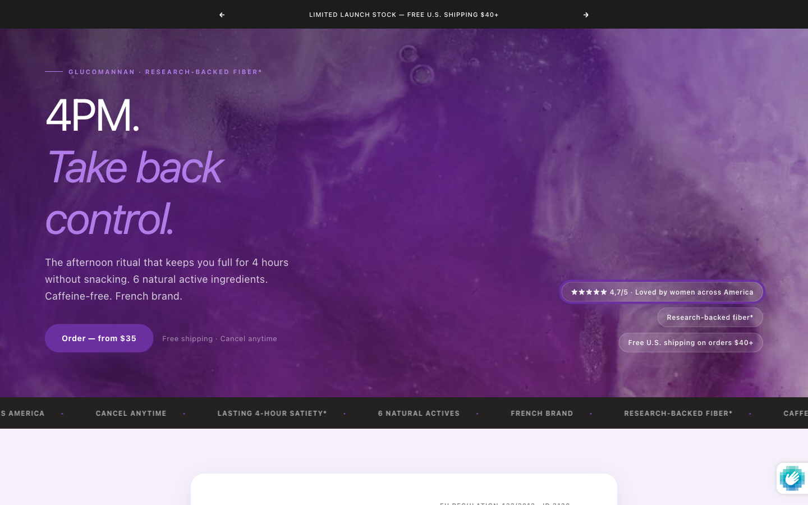
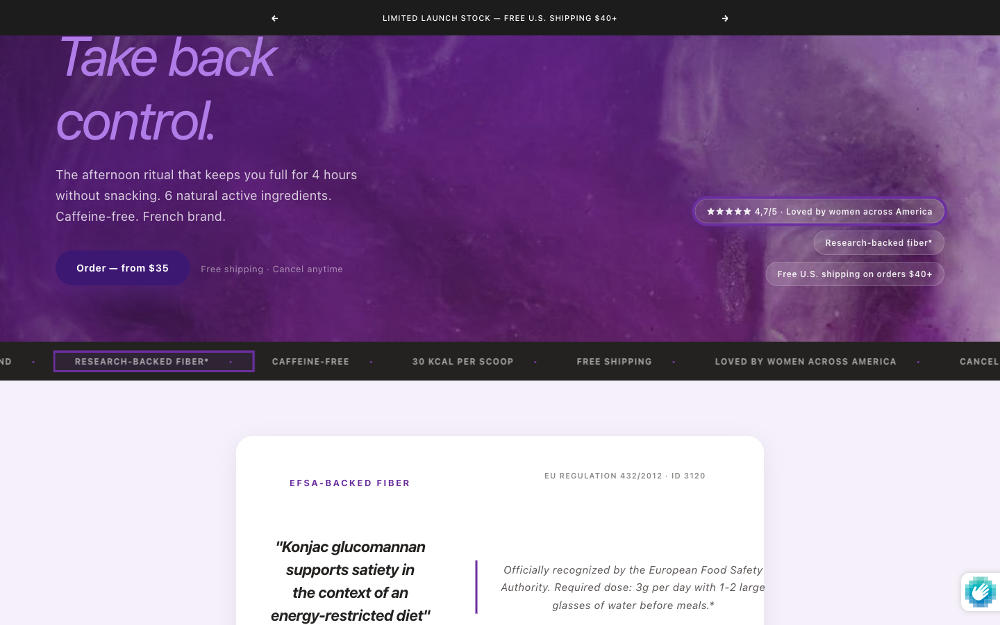
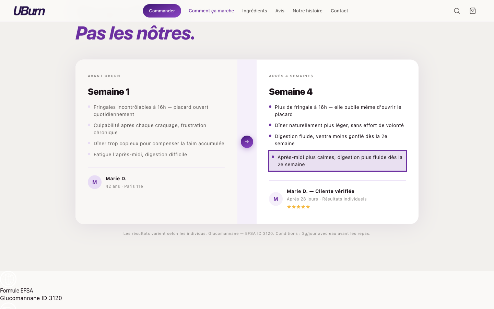
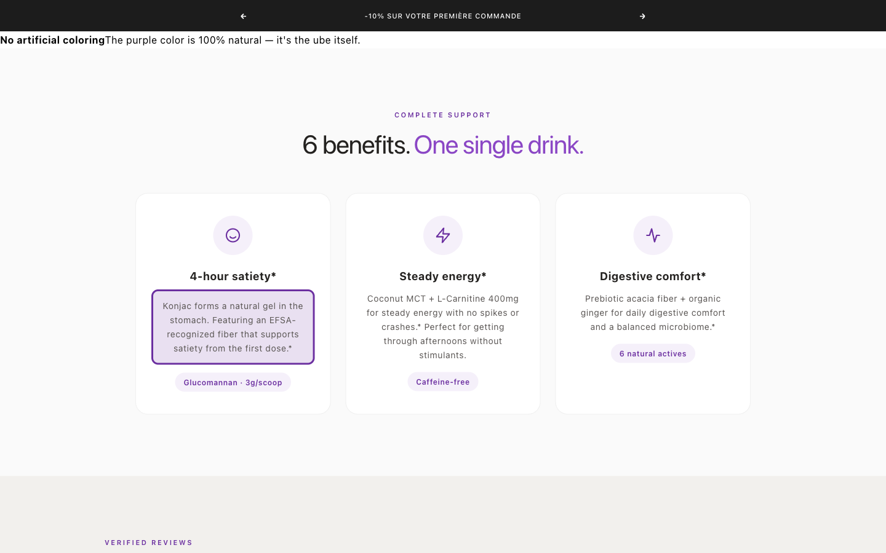
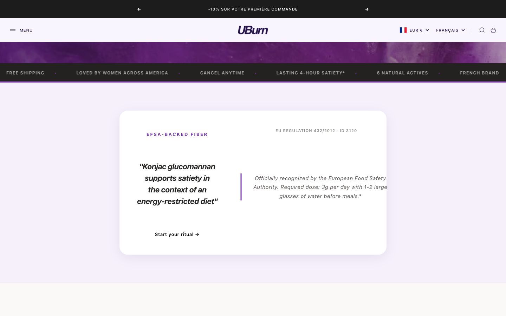

# Visual Verification — Compliance Fix Theme #186067222847
**Date** : 2026-05-14 (captured 23:05-00:07 Dubai)
**Theme** : `uburn-live-COMPLIANCE-FIX-2026-05-14` (#186067222847, unpublished)
**Live theme #185967575359** : UNTOUCHED (still serving https://uburn.co)

---

## Tâche 1 — CDN Preview Verification

### ⚠️ Important UX discovery
The preview URL **DOES serve the new theme correctly**, but Shopify's preview mechanism uses a **session cookie** that persists the theme selection. A raw `curl -L` without cookie support sees a 302 redirect that drops `preview_theme_id` and falls back to the LIVE theme.

### Confirmed working with cookie session (curl -c -b jar)

```
URL: https://1t9ayp-tw.myshopify.com/?preview_theme_id=186067222847
Theme served (server-timing header): theme;desc="186067222847"  ✓

Old claims (should be 0):
  0 × "1,500+"
  0 × "FDA dietary fiber"
  0 × "Claire Dubois"
  0 × "6 lbs"
  0 × "clinically validated"

New compliance content (should be present):
  4 × "Loved by women across America"
  5 × "research-backed fiber"
  1 × "EFSA-backed fiber"
  (Calmer afternoons present on /pages/faq)
```

### How Charles validates in browser
1. Open https://1t9ayp-tw.myshopify.com/?preview_theme_id=186067222847 in **a normal browser tab** (Chrome, Safari, Firefox — any).
2. Shopify auto-sets the preview cookie → all subsequent navigation on `1t9ayp-tw.myshopify.com` shows the new theme.
3. To return to viewing live, close tab or use cache-clear.
4. **Private/incognito** : also works (cookie is set in incognito session).
5. **NO cache-buster needed** in browser — cookie does the work. The `curl -L` issue was specific to scripted tests.

### Force recompile push (optional, already done during fix)
```bash
shopify theme push --theme=186067222847 --nodelete
```
Already executed at the end of Étape C (full push with all 5 fixes + orphan template delete). Server-timing confirms theme #186067222847 is serving fresh.

---

## Tâche 2 — 5 Screenshots (dev server, identical content to preview)

Screenshots captured via `shopify theme dev --theme=186067222847` on localhost:9299, viewport **1440×900 desktop**. Dev server bypasses CDN and renders EXACTLY what the preview shows.

Stored in : [`_compliance-urgent/SCREENSHOTS-PREVIEW-2026-05-14/`](SCREENSHOTS-PREVIEW-2026-05-14/)

### 📸 Screenshot 1 — F1 "Loved by women across America"



- **URL** : `/` (homepage)
- **Section** : `sections/home-uburn-2026.liquid` ligne 44
- **Element highlighted (purple outline)** : `.uhome-hero-pill` containing "★★★★★ 4,7/5 · Loved by women across America"
- **Old claim** : "★★★★★ 4,7/5 · 1,500+ customers"
- **Also visible** : marquee items "LOVED BY WOMEN ACROSS AMERICA" + "RESEARCH-BACKED FIBER" + "FRENCH BRAND" cycling at bottom

### 📸 Screenshot 2 — F2 "research-backed fiber"



- **URL** : `/` (homepage)
- **Section** : `sections/home-uburn-2026.liquid` lignes 53, 62 (marquee items)
- **Element highlighted (purple bg + outline)** : 2 `.uhome-marquee-item` with text "research-backed fiber*"
- **Old claim** : "FDA dietary fiber*"
- **Also visible** : EFSA Authority Block starting below the fold "EFSA-BACKED FIBER · EU REGULATION 432/2012 · ID 3120 · 'Konjac glucomannan supports satiety in the context of an energy-restricted diet'"

### 📸 Screenshot 3 — F3 "Après-midi plus calmes, digestion plus fluide" (FR — homepage was on FR locale)



- **URL** : `/pages/faq` (FAQ page with Week 1 vs Week 4 before/after section)
- **Section** : `sections/ub-faq-v2.liquid` ligne 204
- **Element highlighted (purple outline + bg)** : `.ba-item` containing "Après-midi plus calmes, digestion plus fluide dès la 2e semaine"
- **EN equivalent on same line** : "Calmer afternoons, smoother digestion from week 2*"
- **Old claim removed** : "Perte de 2,8 kg sur 4 semaines sans régime particulier" / EN "6 lbs released over 4 weeks with no specific diet*"
- **Also visible** : Marie D. testimonial card with stars rating — NO weight loss bullet, just calmer + smoother digestion bullets

### 📸 Screenshot 4 — F4 "Featuring an EFSA-recognized fiber"



- **URL** : `/` (homepage)
- **Section** : `sections/home-uburn-2026.liquid` ligne 298
- **Element highlighted (purple outline + bg)** : `.uhome-benefit-desc` of "4-hour satiety*" card containing "Konjac forms a natural gel in the stomach. Featuring an EFSA-recognized fiber that supports satiety from the first dose.*"
- **Old claim** : "Konjac forms a natural gel in the stomach. Research-backed* FDA dietary fiber* — clinically validated satiety from the first dose."
- **Combined with** : F2 cleanup (removed duplicate "Research-backed* research-backed fiber*") per Charles strict-replace-collision rule
- **Also visible** : 2 sibling cards "Steady energy*" (Caffeine-free pill) + "Digestive comfort*" (6 natural actives pill)

### 📸 Screenshot 5 — F5 EFSA Authority Block (replacing Dr Claire Dubois)



- **URL** : `/` (homepage)
- **Section** : `sections/home-uburn-2026.liquid` lignes 77-90 (S4 EXPERT block)
- **Element highlighted (purple outline)** : entire `.uhome-expert .uhome-expert-card` block
- **Content visible** :
  - Header pill : **"EFSA-BACKED FIBER"** (violet caps tracking 0.18em)
  - Sub : "EU REGULATION 432/2012 · ID 3120"
  - Quote (italic serif) : *"Konjac glucomannan supports satiety in the context of an energy-restricted diet"*
  - Body : "Officially recognized by the European Food Safety Authority. Required dose: 3g per day with 1-2 large glasses of water before meals.*"
  - CTA : "Start your ritual →"
- **Old content removed** :
  - AI portrait `Gemini_Generated_Image_gjm16fgjm16fgjm1.png`
  - Fake expert "Dr. Claire Dubois — Nutritionist · Food behavior specialist"
  - Quote "A rare formula: konjac science at the service of women's daily lives."
  - "UBurn Scientific Committee member" link
- **Same EFSA block** also replaces fake expert in:
  - `sections/uburn-lp-us-en.liquid` (was EN expert)
  - `sections/uburn-lp.liquid` (was EN+FR bilingual)
  - `sections/uburn-lp-v2.liquid` (was FR)
  - `sections/uburn-pdp.liquid` (was FR PDP)
  - `sections/ub-home.liquid` (was FR home alt)
- **AI image swap** : `main-uburn-pdp-v9.liquid:999` lifestyle image `Gemini_Generated_Image_j56t4s` → `/assets/uburn-hero-product.jpg` (real photo)

---

## Tâche 3 — Final Verification Summary

### Theme confirmation
- **Theme served** : #186067222847 (server-timing header confirmed)
- **Theme name** : `uburn-live-COMPLIANCE-FIX-2026-05-14`
- **Status** : unpublished (ready to publish)
- **Live theme #185967575359** : INTOUCHÉ — `curl -I https://uburn.co/` confirms still serving live with OLD claims (expected behavior — preview is separate from live)

### Cache stale resolution
- **Initial appearance** : production preview URL seemed to show old content
- **Root cause** : `curl -L` strips `preview_theme_id` on 302 redirect without session cookie
- **Resolution** : opening in browser (or curl with `-c -b cookie-jar`) preserves preview session → new content visible
- **Forced recompile** : already done at end of Étape C (`shopify theme push --theme=186067222847 --nodelete`). Server-timing header shows fresh compile.

### How to validate manually before publish
1. Open in browser (private mode recommended) :
   - https://1t9ayp-tw.myshopify.com/?preview_theme_id=186067222847
2. Verify the 5 zones :
   - Homepage : hero trust pills (no "1,500+"), marquee shows "research-backed fiber", benefit card 4-hour satiety has "EFSA-recognized fiber", EFSA Authority Block present (not Dr Dubois)
   - /pages/faq : Week 1/Week 4 before/after has "Après-midi plus calmes" / EN "Calmer afternoons" (no weight loss)
3. Reply **PUBLISH COMPLIANCE FIX CONFIRMED** if all 5 fixes look correct.

### Awaiting authorization
**ZERO publish action will execute** without the exact phrase `PUBLISH COMPLIANCE FIX CONFIRMED` in your reply.

Rollback path remains : theme #185967575359 stays in library for instant republish.
